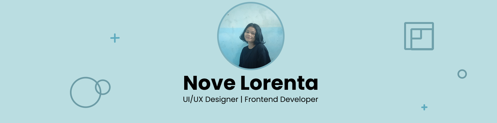

## Hi, I'm Nove Lorenta👋

I am a UI/UX designer with a background in Computer Engineering, interested in creating useful, user-friendly, and meaningful digital products.

### 📚 I'm curently learn:

🌱 Currently focusing on:
-  Improving design thinking, usability, and problem-solving through real-world projects
-  Exploring the connection between design and basic web implementation

### 📫 Connect with me:

[Linkedin](https://www.linkedin.com/in/lorenta-sihotang/) | [Behance](https://www.behance.net/rentasihotang) | [Email](mailto:sihotangrenta04@gmail.com)  | [Instagram](https://www.instagram.com/novelorenta09/) 

### 🌟 Tools & Tecnologies:

   
 

<!-- 

 -->
